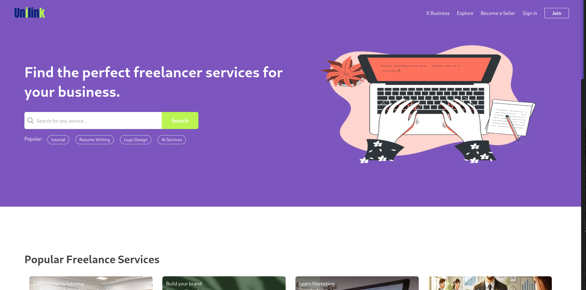

# Unilink : Freelance Marketplace
with Next.js, Tailwind CSS, Node.js, Prisma, MongoDB

UniLink: A Digital Collaboration Platform Connects UIR students across diverse fields for academic projects. Allows students to showcase skills and find peers with expertise. Provides part-time job opportunities. Enhances learning, practical experience, and employability.

## Features

- User Authentication
- User Profiles
- Gig Listings
- Real-time Communication
- Payment Integration (Stripe)
- Ratings and Reviews
- Search and Filters
- Seller Dashboard

## Tech Stack

- Next.js
- Tailwind CSS
- Node.js
- MongoDB with Prisma

## Getting Started

1. Clone the repository and install dependencies.
2. Start the development server.
3. Visit `http://localhost:3000` in your web browser.

N lets connect : https://msboufanzi.github.io/Portfolio/

Feel free to explore the project, suggest improvements, and provide feedback. Happy freelancing with Unilink! 🚀
.....
